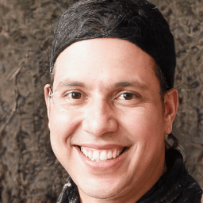

# DyStyle: Dynamic Neural Network for Multi-Attribute-Conditioned Style Editing


**Figure**: Sequential edits using DyStyle model.

Great diversity and photorealism have been achieved by unconditional GAN frameworks such as StyleGAN and its variations. In the meantime, persistent efforts have been made to enhance the semantic controllability of StyleGANs. For example, a dozen of style manipulation methods have been recently proposed to perform attribute-conditioned style editing. Although some of these methods work well in manipulating the style codes along one attribute, the control accuracy when jointly manipulating multiple attributes tends to be problematic. To address these limitations, we propose a Dynamic Style Manipulation Network (DyStyle) whose structure and parameters vary by input samples, to perform nonlinear and adaptive manipulation of latent codes for flexible and precise attribute control. Additionally, a novel easy-to-hard training procedure is introduced for efficient and stable training of the DyStyle network. Extensive experiments have been conducted on faces and other objects. As a result, our approach demonstrates fine-grained disentangled edits along multiple numeric and binary attributes. Qualitative and quantitative comparisons with existing style manipulation methods verify the superiority of our method in terms of the attribute control accuracy and identity preservation without compromising the photorealism. The advantage of our method is even more significant for joint multi-attribute control.

[[paper]()]

## Demo

### Single Attribute edits

1. examples when editing smile, pitch, yaw and glass on real face

<figure>


</figure>
2. examples when editing age, hair color, yaw and glasses on real face
<figure>


</figure>
3. examples when editing pupil color, hair color, mouth size and hair length on anime face. 
<figure>


</figure>
4. examples when editing facial expressions on real face. 
<figure>




</figure>

### Multiple Attribute Edits

1. examples when editing both yaw and glass on real face.

<figure>


</figure>

## Installation

1. Clone this repo.
2. This code require PyTorch, Python 3+. Please install the dependencies by

```sh
conda env create -f environment.yml
```

## Editing Images with Pretrained Model

Before editing images, you need to [prepare](test.md) the **checkpoint**, **GAN generator** and **edit config**.

Then you can just run the following scripts,

```
sh run_test_adult.sh [device_id]
sh run_test_anime.sh [device_id]
sh run_test_cat.sh [device_id]
sh run_test_dog.sh [device_id]
```

## Training DyStyle Model

Before training DyStyle Model, you need to [prepare](train.md) the **GAN generator**, **Attribute Classifier** and **model config**.

Then you can just run the following scripts,

```
sh run_train_adult.sh [device_id]
sh run_train_anime.sh [device_id]
sh run_train_cat.sh [device_id]
sh run_train_dog.sh [device_id]
```

## License

To be updated.

## Citation

To be updated.
